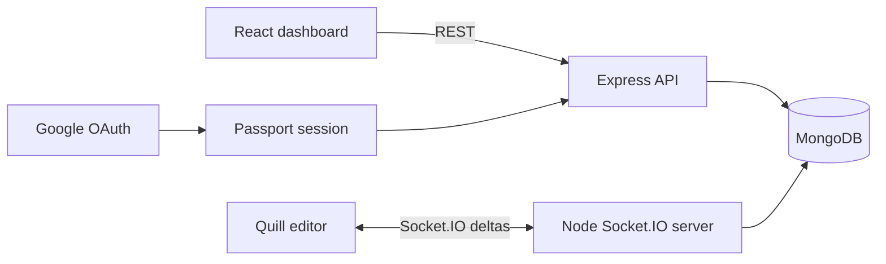

# CollabDocs

A MERN collaborative document editor with Google OAuth, JWT-protected document management, Quill rich-text editing, and real-time updates over Socket.IO.

## Features

- Create, list, open, and delete documents
- Rich-text editing with Quill
- Real-time delta broadcast between editors in the same document room
- Automatic MongoDB persistence every two seconds
- Google OAuth login with Passport
- JWT-protected REST routes
- Private dashboard for a user's documents

## Architecture



## How collaboration works

Each editor joins a Socket.IO room identified by the document ID. User-generated Quill deltas are sent to the server and broadcast to the other clients in that room. The current document is loaded from MongoDB when the editor opens, and the client periodically sends the full Quill document state for persistence.

## Tech stack

- React 18 and React Router
- Quill 2
- Material UI and Emotion
- Node.js and Express
- Socket.IO
- MongoDB and Mongoose
- Passport Google OAuth 2.0
- JSON Web Tokens

## Run locally

### Prerequisites

- Node.js and npm
- MongoDB
- Google OAuth credentials

### Server

```bash
git clone https://github.com/vaibhavsaran03/CollabDocs.git
cd CollabDocs/server
npm install
```

Create `server/.env`:

```env
PORT=9000
MONGODB_URI=your_mongodb_connection_string
SESSION_SECRET=your_session_secret
GOOGLE_CLIENT_ID=your_google_client_id
GOOGLE_CLIENT_SECRET=your_google_client_secret
```

Configure this Google OAuth callback URL:

```text
http://localhost:9000/auth/google/callback
```

Start the API and Socket.IO server:

```bash
npm start
```

### Client

In another terminal:

```bash
cd CollabDocs/client
npm install
npm start
```

Open `http://localhost:3000`.

## Repository structure

```text
.
├── client/
│   └── src/
│       ├── component/
│       └── context/
└── server/
    ├── config/
    ├── controller/
    ├── middleware/
    ├── routes/
    ├── schema/
    └── utils/
```

## Current scope

This is a working prototype. Real-time edits are broadcast as Quill deltas, but it does not yet implement conflict-resolution guarantees such as operational transformation or a CRDT. Production work would also include deployment configuration, environment-based client URLs, authorization checks on Socket.IO document rooms, test coverage, rate limits, and reconnect/offline handling.
